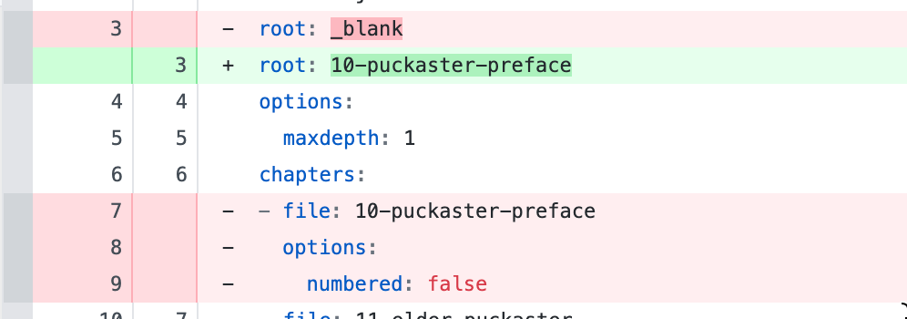

# island-tales-book-one
Island Tales, Book 1

BUILD:

Force a page break: `$\pagebreak$`

https://github.com/tbroadley/spellchecker-cli\

spellchecker -l en-GB  --files  *.md --dictionaries _dictionary_godshill.txt  > spellingreport.txt

jb clean .

jb build --toc _toc_godshill.yml --config _config_godshill.yml --builder pdflatex .

jb build --toc _toc_puckaster.yml --config _config_puckaster.yml --builder pdflatex .

jb build --toc _toc_topham.yml --config _config_topham.yml --builder pdflatex .

https://barcode.tec-it.com/

12.36 in x 9.25

---

pandoc tea-tales-logo.md -o teatales_logo_b_on_w.pdf --pdf-engine=xelatex        

magick -density 300  teatales_logo_b_on_w.pdf -alpha off teatales_logo_b_on_w.png

PDF to image

magick  -density 300 input.pdf output.jpg
magick -density 300 input.pdf output.tiff

## TO DO

I need an epub route. Maybe start moving everything to quarto???

Need to hack the toc used for pdf?

 - Export to docx then use amazon kindle pub tool

List fonts on mac: `fc-list : family`