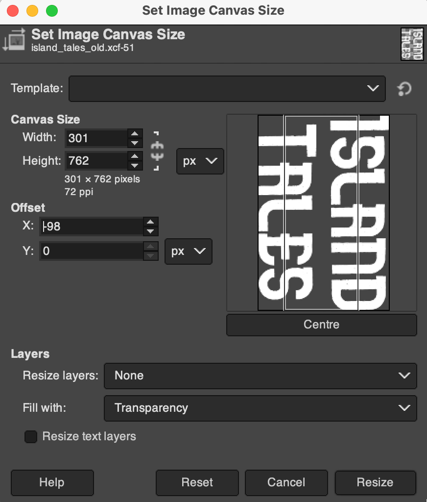

# Manipulations

## Gimp

Image manipulations in Gimp.

### Crop to content:

 - `Image → Crop to Content`: *GIMP will automatically crop the canvas to the smallest rectangle that contains all non-transparent (and non-background) pixels.*

### Crop based on centre line

- use *center* to align
- untether aspect ratio)

## Imagegick

Resize to x height:

`magick images/island_tales_cropped_spine.png -units PixelsPerInch -density 300 -resize x2500 images/island_tales_resized_cropped_spine.png`
